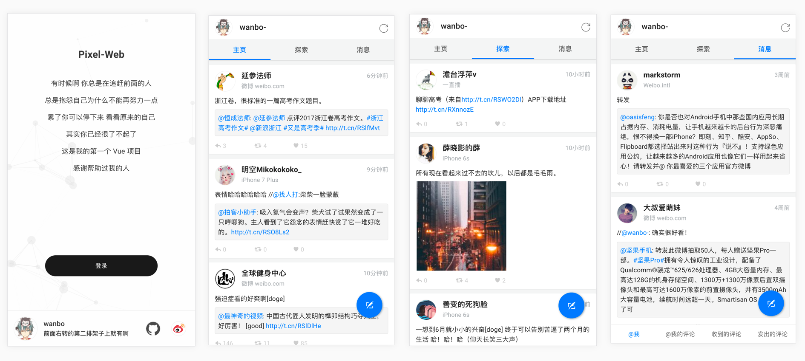
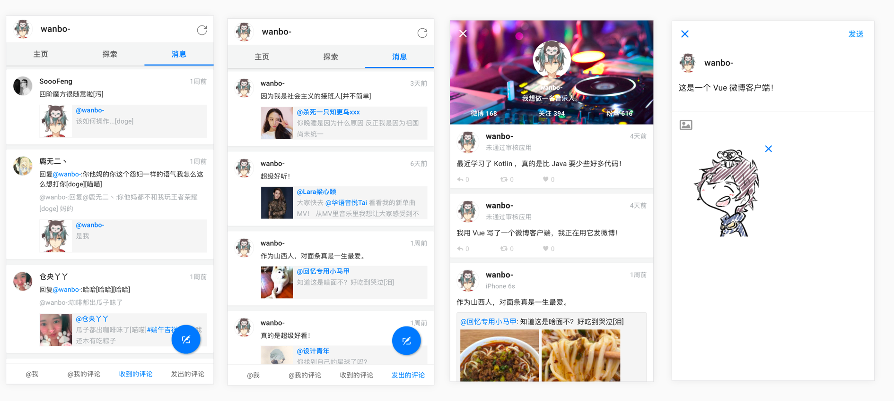
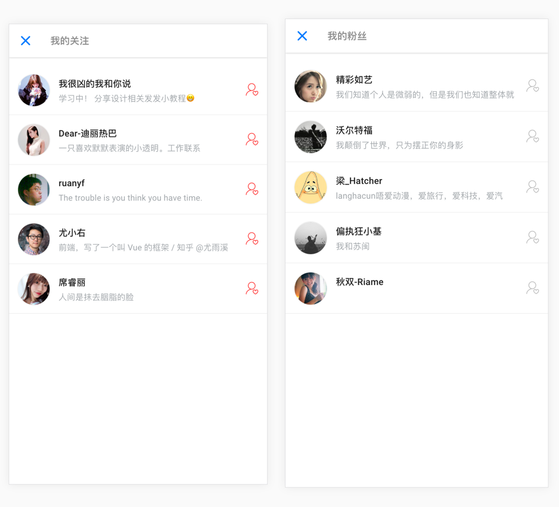

# Pixel-Web

* 这是一个 Vue 微博客户端
* Github项目地址：[https://github.com/Werb/Pixel-Web](https://github.com/Werb/Pixel-Web)
* 欢迎关注我的微博：[wanbo-](http://weibo.com/singerwannber)

### Intro
* 我是一个前端小白，突发奇想自学 Vue ，前前后后写了一个月时间
* 使用 vue-cli 构建、打包, 配合 vue全家桶（vue、vuex、vue-router）进行编码
* 使用 axios 进行资源请求
* 使用 Node.js 对 api 进行二次封装解决跨域问题

### Server
* 使用 Nodejs + Express 开发
* 实现 Oauth登录，查看最新微博，查看单条微博评论，个人主页，我的关注，我的粉丝，发微博以及四种消息（@我的微博，@我的评论，收到的评论，发出的评论）
* Github项目地址：[https://github.com/Werb/Pixel-Api](https://github.com/Werb/Pixel-Api)

### Preview

### Run
 请在 Chrome 手机模式下调试

`npm install`

`npm run dev`

### Tips
* 在开始前需要在新浪开放平台注册应用
* 我选择的是 微连接 - 网页应用 
* 创建成功后保存 App Key 和 App Secret
* 然后设置 OAuth2.0 授权回调页，用于我们在登录后回调到我们的网页中，具体请看 [api-config.js](./src/api/config/api-config.js)

### Thanks
* [daily-zhihu](https://github.com/walleeeee/daily-zhihu)
* [douban](https://github.com/jeneser/douban)
* [NeteaseCloudMusicApi](https://github.com/Binaryify/NeteaseCloudMusicApi)
* [temool](https://github.com/temool)

### LICENSE
[Apache License](./LICENSE)

